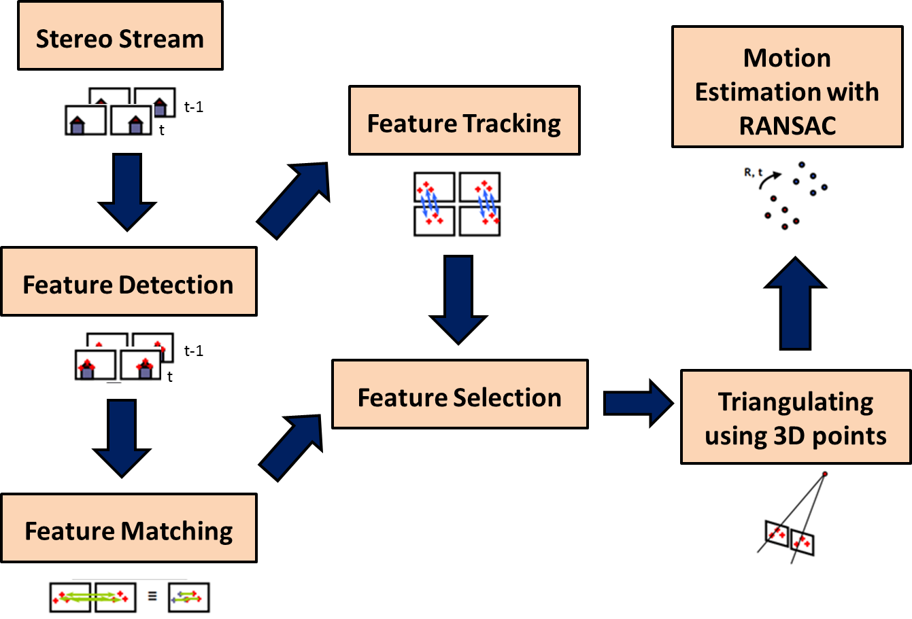
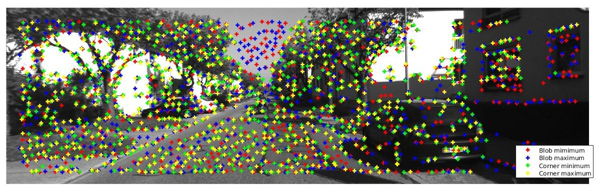
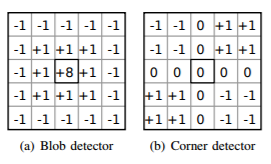
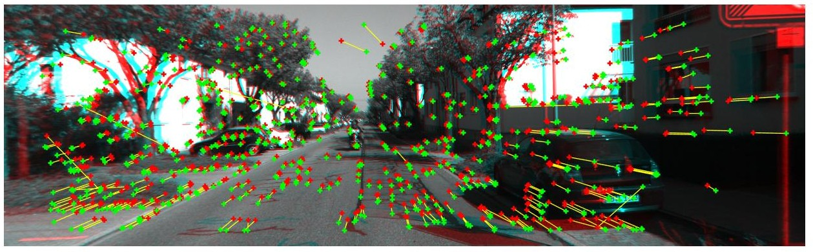
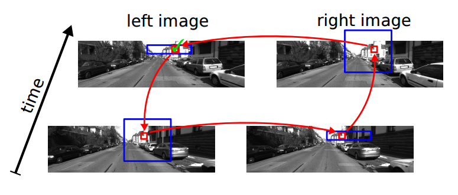
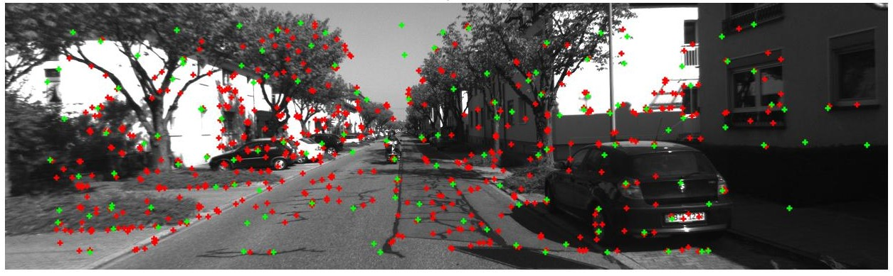
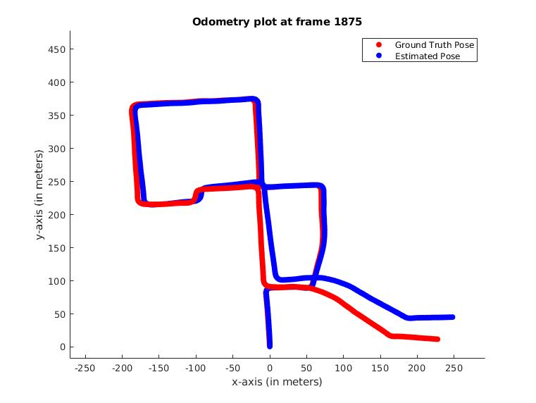

# Stereo-Odometry-SOFT

This repository is a MATLAB implementation of the [Stereo Odometry based on careful Feature selection and Tracking](https://ieeexplore.ieee.org/iel7/7320493/7324045/07324219.pdf). The code is released under [MIT License](LICENSE.md).

The code has been tested on [MATLAB R2018a](https://in.mathworks.com/?s_tid=gn_logo) and depends on the following toolboxes:
* Parallel Processing Toolbox
* Computer Vision Toolbox

On a laptop with `Intel(R) Core(TM) i7-8750H CPU @ 2.20GHz` and `16GB RAM`, the following average timings were observed:
* Time taken for feature processing (in ms): 261.4
* Time taken for feature matching (in ms): 3650.5
* Time taken for feature selection (in ms): 6.5
* Time taken for motion estimation (in ms): 1.1

## How to run the repository?

1. Clone the repository using the following command:
```
git clone https://github.com/Mayankm96/Stereo-Odometry-SOFT.git
```

2. Import the dataset to the folder [`data`](data). In case you wish to use the [KITTI](http://www.cvlibs.net/datasets/kitti/) Dataset, such as the [Residential dataset](http://www.cvlibs.net/datasets/kitti/raw_data.php?type=residential), the following command might be useful:
```bash
cd PATH/TO/Stereo-Odometry-SOFT
## For Reseidential Sequence: 61 (2011_09_46_drive_0061)
# synced+rectified data
wget -c https://s3.eu-central-1.amazonaws.com/avg-kitti/raw_data/2011_09_26_drive_0009/2011_09_26_drive_0009_sync.zip -P data
# calib.txt
wget -c https://s3.eu-central-1.amazonaws.com/avg-kitti/raw_data/2011_09_26_calib.zip -P data
```

3. Change the corresponding paramters in the configuration file [`configFile.m`](code/config/configFile.m) according to your need

4. Run the script [`main.m`](code/main.m) to get a plot of the estimated odometry


## Proposed Implementation of the Algorithm

The input to the algorithm at each time frame, are the left and right images at the current time instant, and the ones at the previous timestamp.

<p align="center">
  
</p>

### Keypoints Detection

In this section, the keypoints detection and matching is divided into following separate stages:
* __feature processing:__ each image is searched for locations that are likely to match well in other images
* __feature matching:__ efficiently searching for likely matching candidates in other images
* __feature tracking:__ unlike to the second stage, the correspondences are searched in a small neighborhood around each detected feature and across frames at different time steps

#### Feature processing

<p align="center">
  
</p>

Corner and blob features are extracted for each image using the following steps:

1. First, blob and checkerboard kernels are convolved over the input image.
<p align="center">
  
</p>

2. [Efficient Non-Maximum Suppression](https://pdfs.semanticscholar.org/52ca/4ed04d1d9dba3e6ae30717898276735e0b79.pdf) is applied on the filter responses to produce keypoints that may belong to either of the following classes: blob maxima, blob minima, corner maxima, and corner minima. To speed up the feature matching, correspondences are only found between features belong to the same class.

3.  The feature descriptors are constructed by using a set of 16 locations out of an 11 x 11 block around each keypoint in input image's gradients. The gradient images are computed by convolving 5 x 5 sobel kernels across the input image. The descriptor has a total length of 32,

#### Feature matching

<p align="center">
  
</p>

This part of the algorithm is concerned with finding the features for egomotion estimation. It is based on the process mentioned in the paper [StereoScan: Dense 3d reconstruction in real-time](https://ieeexplore.ieee.org/document/5940405). The process can be summarized as follows:

1. Correspondences in two images are found by computing the Sum of Absolute Differences (SAD) score between a feature in the first image with the one lying in the second image that belongs to the same class

2. This matching is done in a circular fasion between the left and right frames at time instants t-1 and t as shown below:
<p align="center">
  
</p>

3. To remove certain outliers, Normalized Cross-Correlation (NCC) is again in a circular fasion using templates of size 21 x 21 pixels around the features that have been matched successfully in the process mentioned above.

#### Feature Selection

<p align="center">
  
</p>

To ensure a uniform distribution of features across the image, the entire image is divided into buckets of size 50 x 50 pixels and feature selection is done to select only the strongest features present in each bucket.

### Egomotion Estimation

Using P3P algorithm along with RANSAC, incremental rotation and translation is estimated.

<p align="center">
  
</p>

## To-Dos

- [ ] fix parfor and for loops to enable running without parallel processing
- [ ] read the camera calibration parameters from calibration file directly
- [ ] add sub-pixel refinement using parabolic fitting
- [ ] add feature selection based on feature tracking i.e. the age of features
- [ ] implement Nister's algorithm and SLERP for rotation estimation
- [ ] use Gauss-Newton optimization to estimate translation from weighted reprojection error
